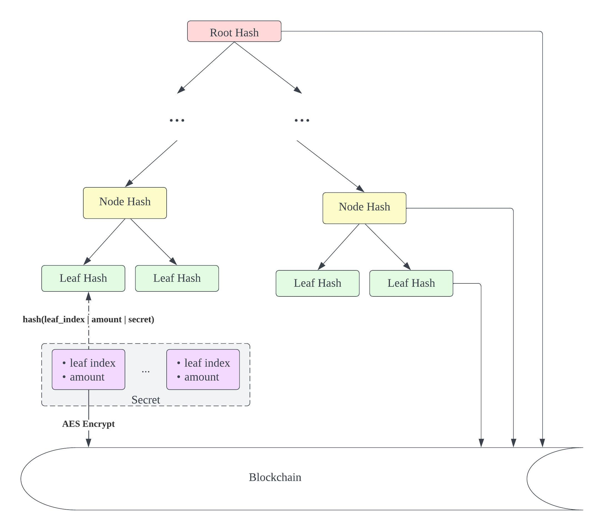
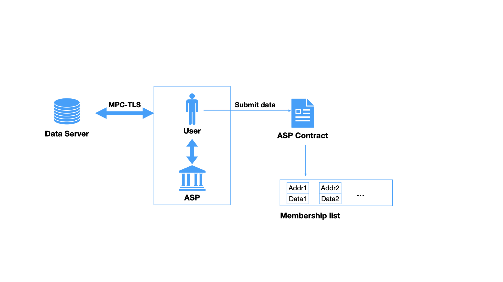

# Advancing Blockchain Transaction Privacy and Compliance: Insights into Innovative Engineering Practices

Authors: Lone(ZKT), Taiyo(ZKT), Xie. X(PADO Labs)

## 1. Introduction

Blockchain privacy and regulatory compliance are experiencing a dynamic shift, significantly inspired by the pivotal works of Vitalik Buterin and [Ameen Soleimani](https://ethresear.ch/u/ameensol). Their insightful paper, "[Blockchain Privacy and Regulatory Compliance: Towards a Practical Equilibrium](https://papers.ssrn.com/sol3/papers.cfm?abstract_id=4563364)[^1]," along with the enlightening [forum post](https://ethresear.ch/t/permissioned-privacy-pools/13572) on permissioned privacy pools, has laid a foundational framework for understanding the intricate balance between maintaining transactional privacy and adhering to regulatory norms. These resources delve deeply into the challenges and viable solutions for synchronizing privacy with compliance in the ever-evolving blockchain landscape.

A key takeaway from their works is the concept of 'honest address sets' which profoundly influences our approach to achieving a second-generation privacy protocol. In this framework, Associate Set Providers (ASPs) emerge as crucial facilitators of credit within the zk-credit system, offering a structured approach to assess and attest to the creditworthiness of users. Meanwhile, membership proof ensures that all participants in a transaction are part of an honest address set, enhancing the security of our protocol and providing a safer, more trustworthy environment for users.

In summary, the works of Buterin and Soleimani have been instrumental in guiding our approach to developing a blockchain system that upholds both privacy and regulatory compliance. By integrating these concepts into our system, we have been able to create a more secure, efficient, and privacy-preserving second-generation protocol.

## 2. System Architecture

At the forefront of this evolution is Vala, an innovative settlement layer that embodies the principles of compliant privacy transactions. Vala integrates a multi-chain cross-chain module, fostering seamless interoperability across various blockchain networks. This feature is pivotal in enabling a boundless crypto ecosystem, where asset transfer and management are not confined to the boundaries of a single blockchain.

Central to Vala's architecture is the Privacy Pool, a sophisticated mechanism that allows users to engage in UTXO (Unspent Transaction Output) model transactions. This model is instrumental in enhancing user privacy while ensuring transactions remain transparent and compliant with regulatory standards. The UTXO model, a hallmark of blockchain technology, offers an efficient way to track asset ownership and transfer, laying the groundwork for secure and private transactions within the Vala ecosystem.

## 3. Technology Stack

The technology stack for ZKT Vala is anchored by zkSNARK for privacy preservation. The UTXO Proof uses a Merkle Tree structure, while Membership Proof employs Plonk + Plookup[^2] for enhanced search speed. The project's zero-knowledge proofs part is implemented in Rust, optimizing performance and security. For the frontend, proof generation utilizes WebAssembly compiled from our Rust code, significantly accelerating the proof generation process for users. This stack represents a blend of advanced cryptographic techniques and efficient programming solutions, tailored for robust and fast privacy transactions.

## 4. Component Details

### 4.1 Infrastructure

The users' fungible assets are hashed into a Binary Merkle Tree. The leaf node is initialized with a constant value $H'=\mathrm{Hash}(0)$ until any asset occupies the slot of the leaf, then the leaf node should be updated to $H=\mathrm{Hash}(identifier \ | \ amount \ | \ commitment)$, where $identifier$ is an associated tag of this asset (like the user's address), $amount$ is the quantity of the asset stored at the leaf node, and $commitment = \mathrm{Hash}(secret)$, with $secret$ being the key of the user who owns the asset.

For an unused leaf node slot, the user can deposit an asset into the pool and take the slot while providing the asset and commitment. For withdrawal, the user should provide the withdrawal amount, new leaf hash, and the snark proof.

### 4.2 Proof of ULO (Unspent Leaf Output)

The design of the withdrawal mechanism is influenced by the Bitcoin UTXO (Unspent Transaction Output) model, which we've adapted into what we call ULO (Unspent Leaf Output). Users select a set of leaf nodes that indicate their assets to use as inputs, then hash the remaining balance into a new leaf node as output. The difference between the total input and the output is the amount of the withdrawal.

Now let the ULO source list be $L$, for each ULO with an index $i\in L$, we must first verify its existence and then calculate the corresponding leaf's nullifier within the circuit as follows:

$$
\begin{aligned}
commitment_i&=\mathrm{Hash}(secret_i)
\\
nullifier_i&=\mathrm{Hash}(secret_i^{-1})
\\
leaf_i&=\mathrm{Hash}(identifier_i \ | \ amount_i \ | \ commitment_i)
\\
root&=\mathrm{MerklePath}(leaf_i, \ elements)
\end{aligned}
$$

Next, we need to demonstrate that the total input amount is equal to the total output amount within the circuit, and then generate the leaf output. The following equations represent this:

$$
\begin{aligned}
\sum_{i\in L}amount_i&=amount_w + amount_o
\\
commitment&=\mathrm{Hash}(secret)
\\
leaf&=\mathrm{Hash}(identifier \ | \ amount_o \ | \ commitment)
\end{aligned}
$$

Where $amount_w$ is the withdrawal amount, $amount_o$ is the output amount.

**Note**
In the above process, we set $\{nullifier_i\}_{i\in L}$, $leaf$, $root$ and $amount_w$ as public variables from the circuits.

### 4.3 Proof of membership

#### 4.3.1 Why not Merkle proof

Proof of membership in Vala lies in demonstrating that the inputs come from an arbitrary set constructed by the user, meanwhile ensuring that this set is publicly available to anyone. Typically, the set can be organized into a new Merkle Tree and the user should prove that each input is also a leaf node of the Merkle Tree (Indeed, privacy-focused solutions like Tornado Cash v2, and Privacy Pools have adopted this kind of design).

Apparently, if the set is too small, the user's privacy is compromised. If the set is too large, generating the corresponding Merkle tree incurs a huge gas cost on EVM, since ZK-friendly hash functions (Poseidon, Rescue) are not integrated by EVM primitively while creating Merkle tree has a complexity of O(n) hash.

We hereby adopt the Plookup to construct proof of membership, instead of Merkle Tree. Let’s take a look at the design idea of Plookup:

*"we precompute a lookup table of the legitimate (input, output) combinations; and the prover argues the witness values exist in this table."*

There are **2** main advantages of Plookup in our membership proof.
- In the proving phase, we do not need to perform existence proofs for each ULO, which significantly reduces the circuit size. 
- In the verification phase, we do not need to perform hash operations in EVM. Only one elliptic curve pairing is required.

#### 4.3.2 Advantages of Plookup
##### 1. Constant Complexity in Circuit Size

Traditionally, Merkle proof methods, when handling a large number of ULO proofs, lead to linear growth in circuit size due to the need for individual existence proofs for each ULO. This results in increased computational complexity and time costs. However, a key advantage of using Plookup in our UTXO model is that it maintains a constant level of complexity in circuit size. Regardless of the number of ULOs to be verified, Plookup can process them within a constant circuit size, significantly reducing the overall circuit size and processing time.

#####  2. Efficiency in the Verification Process

Another advantage of Plookup in the verification phase is the elimination of the need for extensive hash operations in the Ethereum Virtual Machine (EVM). In contrast, traditional Merkle proofs require hashing at each node during verification, which is not only time-consuming but also computationally costly. Plookup simplifies the verification process by using a single elliptic curve pairing operation to ascertain the existence of ULOs. This approach not only speeds up the verification but is also more efficient in conserving computational resources.

##### Application of Plookup in the UTXO Model

In our UTXO model, each user's funds are represented as multiple encrypted ULOs, each indicating a specific amount of assets. With Plookup, we can effectively process and verify these ULOs irrespective of their quantity. This method enhances the scalability and efficiency of the entire system, particularly in handling a large volume of transactions and complex fund movements.

In summary, Plookup provides significant benefits in our membership proof system, especially in managing numerous ULOs within the UTXO model. This approach not only reduces computational burden but also enhances the overall system efficiency and performance.

#### 4.3.3 Plookup implementation

Assuming the user provides an identifier list of size $m$ from the source ULOs, denoted as $t$, then we pad the set $t$ with 0 until it satisfies the size of circuit size $n$.

$$
t=\{id_0,id_1,..,0,..,0\}
$$

Let $f$ be the query table:

$$
f_i =
\left\{\begin{matrix}
c_i, &\ \mathrm{if \ the} \ i\mathrm{\ gate \ is \ a \ lookup \ gate}
\\
0, &\ \mathrm{otherwise}
\end{matrix}\right.
$$

Where $c_i$ is the witness variable defined in the arithmetic gate of Plonk. When $c_i$ represents the identifier variable, $f_i$ equals to $c_i$.

Permutation polynomial is defined as

$$
\begin{aligned}
z_2(X)=&(d_2X^2+d_1X+d_0)Z_H(X)+L_1(X)
\\
&+\sum_{i=1}^{n-1}\left(L_{i+1}(X)\prod_{j=1}^{i}\frac{(1+\delta)(\varepsilon+f_j)(\varepsilon(1+\delta)+t_j+\delta t_{j+1})}{(\varepsilon(1+\delta)+s_{2j-1}+\delta s_{2j})(\varepsilon(1+\delta)+s_{2j}+\delta s_{2j+1})}\right)
\end{aligned}
$$

Extend the quotient polynomial of Plonk, which is similar to the Plonkup zk-snark[^3]:

$$
q(X)=\frac{1}{Z_H(X)}
\left(
\begin{aligned}
&a(X)b(X)q_M(X)+q(X)q_L(X)+b(X)q_R(X)+c(X)q_O(X)+q_C(X)+\mathrm{PI}(X)
\\
&+ \ ... \ ...
\\
&+q_K(X)(c(X)-f(X))\alpha^3
\\
&+z_2(X)(1+\delta)(\varepsilon+f(X))(\varepsilon(1+\delta)+t(X)+\delta t(\omega X))\alpha^4
\\
&-z_2(\omega X)(\varepsilon(1+\delta)+h_1(X)+\delta h_2(X))(\varepsilon(1+\delta)+h_2(X)+\delta h_1(\omega X))\alpha^4
\\
&+(z_2(X)-1)L_1(X)\alpha^5
\\
&+q_T(X)t(X)\alpha^6
\end{aligned}
\right)
$$

Where the selector $q_K(X)$ switches on/off the lookup gate, $q_T(X)$ controls the padding elements should be all 0.

During the verification phase, in addition to the zk-SNARK proof verification, we just need to verify the opening proof of $t(X)$ at $\{\omega, \omega^2, .., \omega^m\}$, without any hash operations on EVM.

**Note**: 
We need to construct an aggregated opening proof, which is called a multi-point opening, and use only one elliptic curve pairing operation.

### 4.3.4 Performance Comparision

TODO

## 5. Associate Set Provider

The Associate Set Provider (ASP) mechanism allows a third party to oversee the membership list. Similar to an attestor, an ASP offers attestation services for end-users. The associated address, along with potential attested and sealed data, is submitted to a designated ASP smart contract. In Vala, any entity can register as an ASP. The selection of which ASP to utilize depends on the choices made by end-users and Dapps.

The data category can be defined by the ASP, allowing support for a diverse range of potential data from web2, such as credit scores, KYC results, etc. For attesting any data obtained through the standard Transport Layer Security (TLS) protocol (e.g, HTTPS) and to accommodate a large volume of potential data, we recommend employing MPC-TLS style algorithms within the ASP. This approach, initially introduced by DECO and significantly improved by PADO, is detailed further in this paper[https://eprint.iacr.org/2023/964.pdf](https://eprint.iacr.org/2023/964.pdf) [^4]. Within this framework, users can prove to the attestor that the data indeed originates from the intended sources without leaking any other information.

We list the basic workflow in the following figure.

The inclusion of data in the membership list is discretionary. This flexibility arises from situations where the data entry might simply be binary (YES/NO). In such cases, the smart contract accepts addresses marked as YES, allowing the omission of unnecessary data entries. However, programmability can be introduced when the sealed data holds additional meanings. For instance, an ASP might attest a user's FICO score and store the encrypted score in the smart contract. Subsequently, Dapps can devise more adaptable withdrawal conditions. For example, users with higher FICO scores may be eligible to withdraw a larger quantity of tokens, whereas those with lower FICO scores might have access to only a smaller amount. This introduces a higher degree of flexibility for designing diverse applications.

## 6. Client-Side Acceleration Solution

In our quest to enhance user experience and efficiency in the Vala system, we've focused on client-side computational optimization. This optimization is crucial for reducing the computational burden on user devices and accelerating transaction and verification processes.

### 6.1 WebAssembly Integration
Our integration of WebAssembly (Wasm) allows for the execution of complex cryptographic proof generation processes directly in the user's browser. By compiling our Rust code into WebAssembly, we've significantly reduced dependency on centralized servers and improved system responsiveness and efficiency.

### 6.2 Local Computation Optimization
#### 6.2.1 Transaction Decision Logic

In our UTXO model, each user's funds are represented as encrypted NOTES, each corresponding to a specific amount of assets (e.g., ETH). Our system intelligently selects the appropriate combination of NOTES to fulfill withdrawal requests. For instance, if a user has NOTES of 1 ETH, 1 ETH, 2 ETH, and 3 ETH and wishes to withdraw 2.5 ETH, our system automatically utilizes the 1 ETH, 1 ETH, and 2 ETH NOTES.

#### 6.2.2 Generation of New Deposit Proofs

Following the utilization of certain NOTES for transactions, our system generates new deposit proofs corresponding to the remaining amount. Continuing the previous example, after spending the 1 ETH, 1 ETH, and 2 ETH NOTES, a new deposit proof for 1.5 ETH is created, ensuring secure and effective management of funds post-transaction.

#### 6.2.3 Implementation in Chrome Plugin and iOS App

To achieve this computational optimization, we've implemented tailored strategies in our Chrome plugin and iOS app. The Chrome plugin optimizes the NOTE selection and new proof generation process, leveraging the browser's processing capabilities. In contrast, our iOS app employs multi-threading technology to accelerate these computations, taking full advantage of the high-performance capabilities of iOS devices.

### 6.3 Caching Strategies
We have implemented caching strategies to reduce redundant computations and network requests. Key data, such as parts of the Merkle Tree, are cached on the user device for quick retrieval in subsequent transactions or verifications, reducing network traffic and significantly enhancing overall system performance.

### 6.4 User Experience Enhancement
Lastly, we place a high emphasis on enhancing the user experience. This involves not only technical optimizations but also improvements in interface design. We ensure that the user interface is intuitive and the transaction process is seamless. Real-time feedback and detailed error messages enhance user trust and satisfaction.

In summary, our client-side acceleration solution is a key strategy for enhancing the performance of the Vala system. Through these technological and methodological applications, we not only enhance the speed and efficiency of transactions but also optimize the user experience, making Vala a more powerful and user-friendly blockchain privacy platform.

## 7. Summary

This paper thoroughly explores the approaches and practices for achieving a balance between privacy protection and regulatory compliance in blockchain technology. By incorporating innovative applications of honest address sets, zk-credit, and membership proof, we demonstrate how to maintain user privacy while adhering to regulatory standards. The focus extends beyond the technical and system architecture to include engineering practices and enhancements in user experience performance. Our aim is to establish a secure, efficient blockchain system that delivers an exceptional user experience. Representing a step forward, this second-generation privacy transaction protocol signifies a better tomorrow, where privacy is not just a feature – it's the norm.

[^1]:[Vitalik Buterin, Jacob Illum, Matthias Nadler, Fabian Schär, Ameen Soleimani (2023). "Blockchain Privacy and Regulatory Compliance: Towards a Practical Equilibrium"](https://papers.ssrn.com/sol3/papers.cfm?abstract_id=4563364)
[^2]:[Luke Pearson, Joshua Fitzgerald, Héctor Masip, Marta Bellés-Muñoz & Jose Luis Muñoz-Tapia, (2022). "plookup: A simplified polynomial protocol for lookup tables"](https://eprint.iacr.org/2020/315.pdf)
[^3]:[Ariel Gabizon, Zachary J. Williamson. (2020). "plonkup: PlonKup: Reconciling PlonK with plookup"](https://eprint.iacr.org/2022/086)
[^4]:[Xiang Xie, Kang Yang, Xiao Wang, Yu Yu. (2023). "Lightweight Authentication of Web Data via Garble-Then-Prove."](https://eprint.iacr.org/2023/964.pdf)
