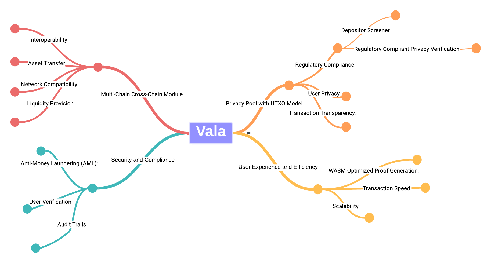

# Advancing Blockchain Transaction Privacy and Compliance: Insights into Innovative Engineering Practices

**1. Introduction**

In the realm of blockchain privacy and regulatory compliance, a dynamic shift is underway, inspired by the pivotal works of Vitalik Buterin and [ameensol](https://ethresear.ch/u/ameensol). Their paper, "[Blockchain Privacy and Regulatory Compliance: Towards a Practical Equilibrium](https://papers.ssrn.com/sol3/papers.cfm?abstract_id=4563364)," alongside the insightful [forum post](https://ethresear.ch/t/permissioned-privacy-pools/13572) on permissioned privacy pools, paves the way for a nuanced understanding of the delicate balance between maintaining transactional privacy and adhering to regulatory norms. These resources offer a profound exploration of the challenges and potential solutions in harmonizing privacy with compliance in the evolving blockchain landscape.

**2. Vala: A Compliant Privacy Settlement Layer**

At the forefront of this evolution is Vala, an innovative settlement layer that embodies the principles of compliant privacy transactions. Vala integrates a multi-chain cross-chain module, fostering seamless interoperability across various blockchain networks. This feature is pivotal in enabling a boundless crypto ecosystem, where asset transfer and management are not confined to the boundaries of a single blockchain.

Central to Vala's architecture is the Privacy Pool, a sophisticated mechanism that allows users to engage in UTXO (Unspent Transaction Output) model transactions. This model is instrumental in enhancing user privacy while ensuring transactions remain transparent and compliant with regulatory standards. The UTXO model, a hallmark of blockchain technology, offers an efficient way to track asset ownership and transfer, laying the groundwork for secure and private transactions within the Vala ecosystem.

## Privacy Pool with UTXO Model

1. **Data Structure**:
    - Off-chain: Users utilize a secret derived from their private key as an identity in Vala.
    - On-chain: User assets are constructed in UTXO-style format, encrypted with AES, and organized into a Balanced Binary Merkle Tree.
2. **Circuits**:
    - Leaf Existence Circuit: Proves a leaf node's existence in the Merkle Tree.
    - Add Leaf Circuit: Allows for adding new leaf hashes to the Merkle Tree.
    - Commit Circuit: Encrypts nullifiers to commitments for compliance audits in cases like money laundering.
    - Deposit and Withdraw Circuits: Manage the insertion and withdrawal of UTXO-style assets in the Merkle Tree.
3. **Regulatory Compliance:** 
    - Deposit Screener: The Deposit Screener, using consensus nodes and entry delays, ensures regulatory compliance by allowing only verified users to enter the transaction pool.
    

## Deposit Screener

## Regulatory-Compliant Privacy Verification

association set providers(ASPs).